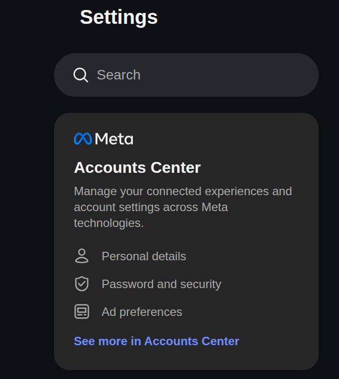
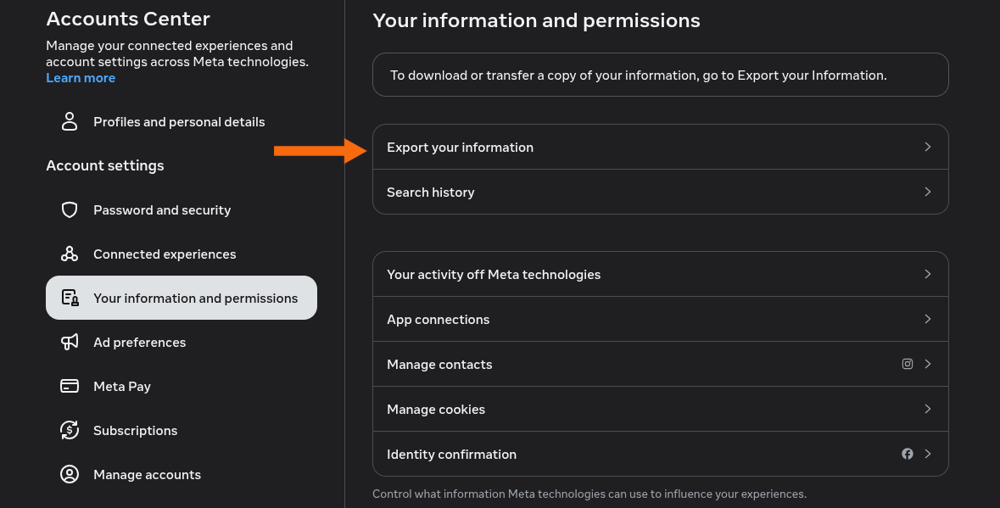
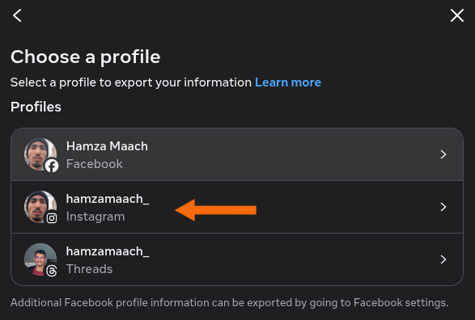
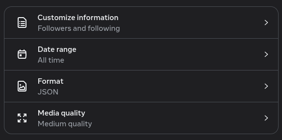

# instagram-request-cleanup

## Overview

This tool cancels pending Instagram follow requests using:

- your exported Instagram data (JSON)
- browser automation via Playwright

---

## 1. Download Your Instagram Data

### Step 1 — Open Accounts Center

- Go to Instagram settings
- Navigate to **Accounts Center**



---

### Step 2 — Request Data Download

- Click: **Your information and permissions**
- Then: **Export your information**



---

### Step 3 — Create Download Request

- Click **Create Export**
- Then your Instagram account
- Then **Export to device**



---

### Step 4 — Confirm your export

#### choose data to export

- Choose **Choose specific info to export**
- Select only:
  - **Followers and following**

#### choose date range

- Choose **All time**

#### choose format

- Choose **JSON**

#### choose media quality

- Choose **Medium quality**



---

### Step 5 — Download the exported data

Once the processing is complete, you will receive an email notification. Open the email and download your exported data from the provided link.

---

## 2. Extract Required File

After extracting the archive:

```

connections/
└── followers_and_following/
                └── pending_follow_requests.json

```

### Move the file

Copy this file into your project root:

```

instagram-request-cleanup/
├── main.py
├── pending_follow_requests.json
├── Makefile

```

---

## 3. Setup & Run

### Step 1 — Setup environment

```bash
make
```

This will:

- create virtual environment
- install dependencies
- install Playwright browsers

---

### Step 2 — Run the script

```bash
make run
```

---

## 4. Usage Flow

1. A browser window opens
2. Log in manually to Instagram
3. Press **ENTER** in terminal
4. Script will:
   - open each profile
   - click **Requested**
   - confirm **Unfollow**
   - cancel the request

---

## 5. Notes

- Do not run too fast → risk of temporary restrictions
- Keep the browser visible (headless = false)
- If UI language is not English, selectors may need adjustment
- Some accounts may:
  - already be canceled
  - not load properly → will be skipped
